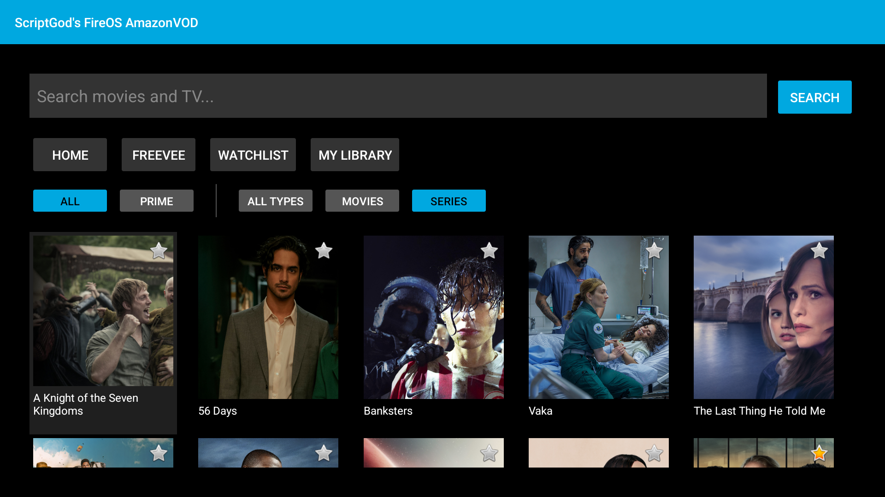

# ScriptGod's FireOS AmazonVOD

Native Android/Kotlin app for Fire TV that streams Amazon Prime Video content with Widevine L1 DRM.

## Features

- **In-app login** with Amazon email/password + MFA support (PKCE OAuth device registration)
- Browse home catalog, watchlist, and personal library
- Search with instant results
- Filter by source (All / Prime) and type (Movies / Series) -- filters combine independently
- Series drill-down: show -> seasons -> episodes -> play
- Widevine L1 hardware-secure playback (DASH/MPD)
- **Audio & subtitle track selection** during playback (5.1/Stereo audio, SDH/Forced/Regular subtitles)
- **Watch progress tracking** via UpdateStream API (START/PLAY/PAUSE/STOP)
- **Resume from last position** -- automatically seeks to where you left off
- Watchlist management (long-press to add/remove)
- Library with pagination, sub-filters (Movies / TV Shows), and sort (Recent / A-Z / Z-A)
- Freevee section (territory-dependent)
- D-pad navigation optimized for Fire TV remote
- Automatic token refresh on 401/403
- **CI/CD** via GitHub Actions with date-based versioning and automatic APK releases

## Architecture

```
com.scriptgod.fireos.avod
 +-- auth/
 |   +-- AmazonAuthService.kt      Token management, OkHttp interceptors (auth, headers, logging)
 +-- api/
 |   +-- AmazonApiService.kt       Catalog, search, detail, watchlist, library, playback, stream reporting
 +-- drm/
 |   +-- AmazonLicenseService.kt   Widevine license: wraps challenge as widevine2Challenge, unwraps widevine2License
 +-- model/
 |   +-- ContentItem.kt            Content data model (asin, title, imageUrl, contentType, isPrime, ...)
 |   +-- TokenData.kt              Token JSON model (access_token, refresh_token, device_id, expires_at)
 +-- ui/
     +-- LoginActivity.kt          Amazon login: email/password + MFA, PKCE OAuth, device registration
     +-- MainActivity.kt           Home screen: search, nav, filters, content grid
     +-- BrowseActivity.kt         Series detail: seasons / episodes grid
     +-- PlayerActivity.kt         ExoPlayer with DASH + Widevine DRM, track selection, resume
     +-- ContentAdapter.kt         RecyclerView adapter with poster images (Coil), watchlist star
     +-- DpadEditText.kt           EditText with Fire TV remote keyboard handling
```

## Screenshots

| Login | Home Catalog | Search Suggestions |
|:---:|:---:|:---:|
|  |  |  |

| Watchlist | My Library | Series Filter |
|:---:|:---:|:---:|
|  |  |  |

| Season Selection | Episode List |
|:---:|:---:|
|  |  |

## Requirements

- Android SDK (API 34, build-tools 34.0.0)
- Java 17
- A valid Amazon account (login in-app) or a `.device-token` file for development

## Build

```bash
./gradlew assembleRelease
```

Output: `app/build/outputs/apk/release/app-release.apk`

### Versioned build (CI style)

```bash
./gradlew assembleRelease \
  -PversionNameOverride=2026.02.26_1 \
  -PversionCodeOverride=20260226
```

## Deploy to Fire TV

```bash
# Connect to Fire TV
adb connect <device-ip>:5555

# Install
adb install -r app/build/outputs/apk/release/app-release.apk

# Launch
adb shell am start -n com.scriptgod.fireos.avod/.ui.LoginActivity
```

## Authentication

### In-app login (recommended)
Launch the app and sign in with your Amazon email, password, and verification code. The app performs PKCE OAuth authentication and registers the device with Amazon. Tokens are saved to the app's internal storage.

### Development token (debugging)
For development, you can pre-push a `.device-token` file:
```bash
adb push .device-token /data/local/tmp/.device-token
adb shell chmod 644 /data/local/tmp/.device-token
```
The app auto-detects an existing token and skips the login screen. Generate the token with `dev/register_device.py`.

## CI/CD

GitHub Actions builds APKs on version tags (`v*`), pull requests to `main`, and manual dispatch. Versioning uses the date format `YYYY.MM.DD_N` (e.g., `2026.02.26_1`).

### Required GitHub Secrets

| Secret | Description |
|--------|-------------|
| `RELEASE_KEYSTORE_BASE64` | Base64-encoded `release.keystore` |
| `RELEASE_STORE_PASSWORD` | Keystore password |
| `RELEASE_KEY_ALIAS` | Key alias |
| `RELEASE_KEY_PASSWORD` | Key password |

Generate the keystore secret:
```bash
base64 -w0 release.keystore | pbcopy  # macOS
base64 -w0 release.keystore           # Linux (pipe to clipboard)
```

Pushing a version tag (e.g., `git tag v2026.02.26_1 && git push --tags`) creates a GitHub Release with the signed APK attached.

## Emulator notes

An Android TV emulator (API 34) works for UI, API development, and login testing. Widevine DRM playback requires a physical Fire TV device (L1 hardware security).

## Development tooling

Agent instructions, build automation scripts, and API analysis are in the `dev/` folder. See `dev/README.md`.
