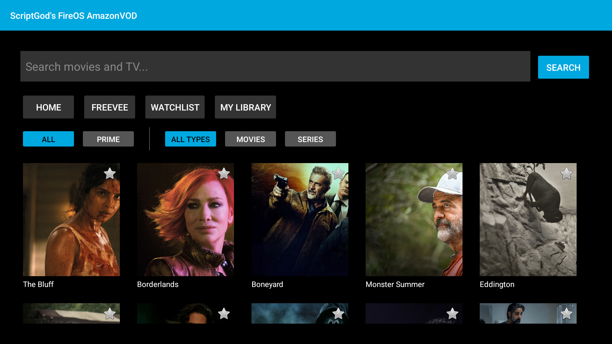
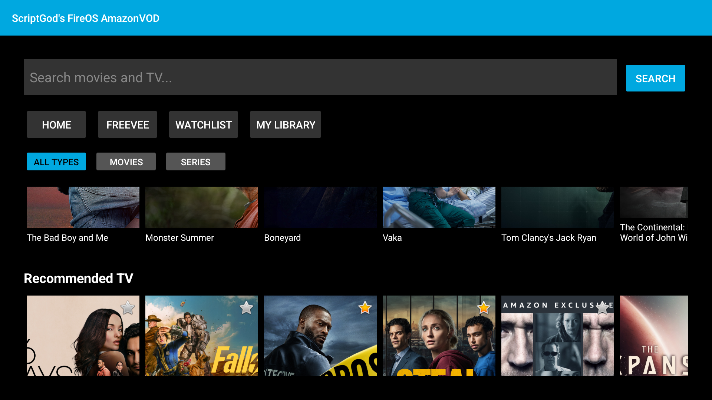
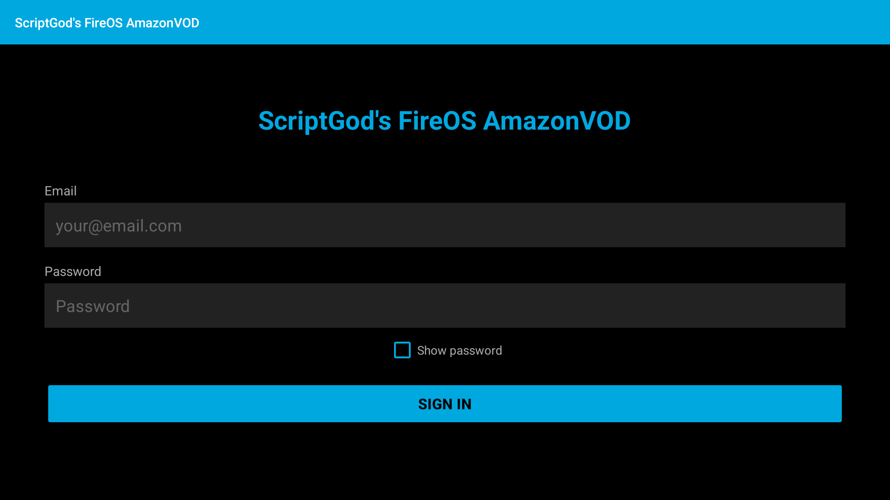
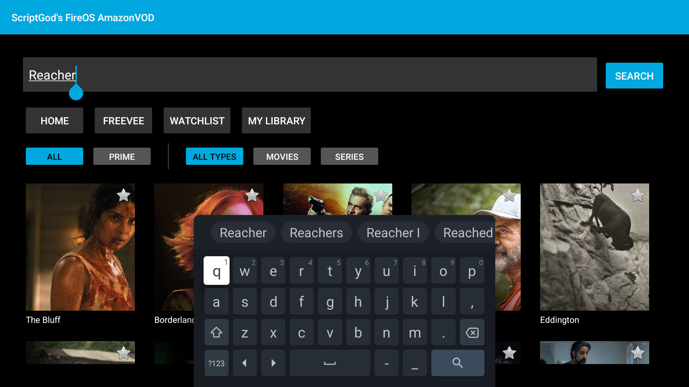
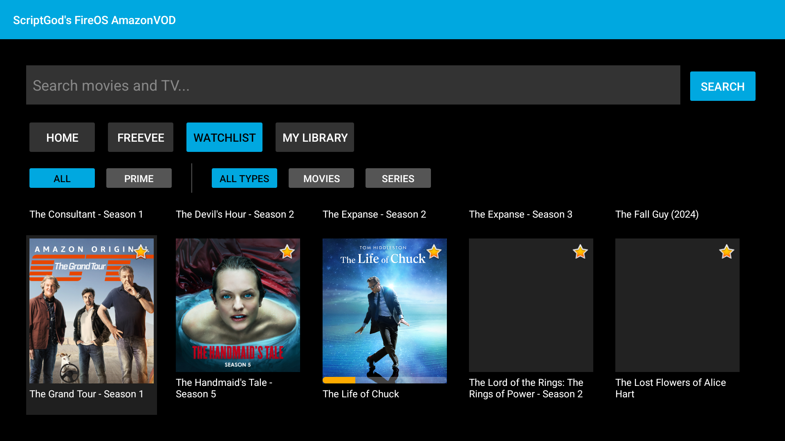
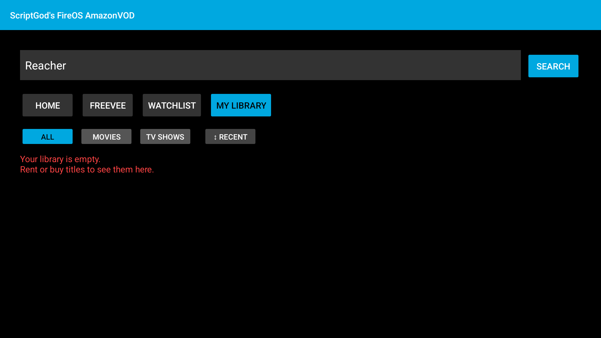
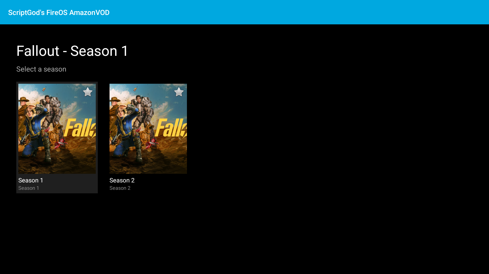
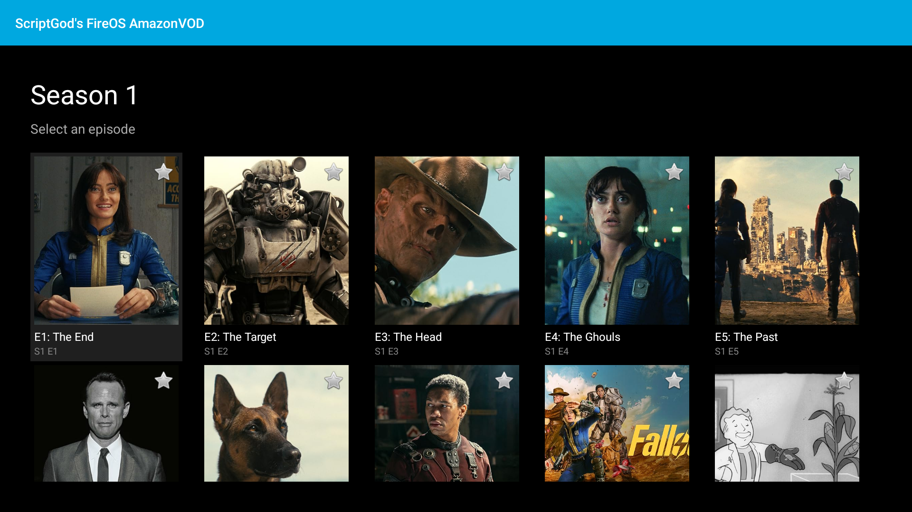

# ScriptGod's FireOS AmazonVOD

Native Android/Kotlin app for Fire TV that streams Amazon Prime Video content with Widevine L1 DRM.

## Features

- **In-app login** with Amazon email/password + MFA support (PKCE OAuth device registration)
- **Home page horizontal carousels** — categorised rails (Featured, Trending, Top 10, etc.) matching the real Prime Video home layout, with page-level infinite scroll for more rails
- **Watch progress bars** on content cards — amber for in-progress, synced with server-side `remainingTimeInSeconds` so progress from the official app shows up here too
- Browse home catalog, watchlist, and personal library
- Search with instant results
- Filter by source (All / Prime) and type (Movies / Series) — filters combine independently
- Series drill-down: show → seasons → episodes → play
- Widevine L1 hardware-secure playback (DASH/MPD)
- **Audio & subtitle track selection** during playback (5.1/Stereo audio, SDH/Forced/Regular subtitles)
- **Watch progress tracking** via UpdateStream API (START/PLAY/PAUSE/STOP)
- **Resume from last position** — automatically seeks to where you left off
- Watchlist management (long-press to add/remove, star indicator)
- Library with pagination, sub-filters (Movies / TV Shows), and sort (Recent / A-Z / Z-A)
- Freevee section (territory-dependent)
- D-pad navigation optimized for Fire TV remote
- Automatic token refresh on 401/403
- **CI/CD** via GitHub Actions with date-based versioning and automatic APK releases

## Architecture

```
com.scriptgod.fireos.avod
 +-- auth/
 |   +-- AmazonAuthService.kt      Token management, OkHttp interceptors (auth, headers, logging)
 +-- api/
 |   +-- AmazonApiService.kt       Catalog, search, detail, watchlist, library, playback, stream reporting
 +-- drm/
 |   +-- AmazonLicenseService.kt   Widevine license: wraps challenge as widevine2Challenge, unwraps widevine2License
 +-- model/
 |   +-- ContentItem.kt            Content data model (asin, title, imageUrl, contentType, watchProgressMs, ...)
 |   +-- ContentRail.kt            Named row of ContentItems (headerText, items, collectionId)
 |   +-- TokenData.kt              Token JSON model (access_token, refresh_token, device_id, expires_at)
 +-- ui/
     +-- LoginActivity.kt          Amazon login: email/password + MFA, PKCE OAuth, device registration
     +-- MainActivity.kt           Home screen: rails or grid, search, nav, filters, pagination
     +-- BrowseActivity.kt         Series detail: seasons / episodes grid
     +-- PlayerActivity.kt         ExoPlayer with DASH + Widevine DRM, track selection, resume
     +-- RailsAdapter.kt           Outer vertical adapter (one row per ContentRail)
     +-- ContentAdapter.kt         Inner horizontal adapter with poster, watchlist star, progress bar
     +-- DpadEditText.kt           EditText with Fire TV remote keyboard handling
```

## Screenshots

| Home — Featured Rail | Home — Multiple Rails |
|:---:|:---:|
|  |  |

| Login | Search Suggestions | Watchlist (with progress bar) |
|:---:|:---:|:---:|
|  |  |  |

| My Library | Season Selection | Episode List |
|:---:|:---:|:---:|
|  |  |  |

## Roadmap

See [dev/progress.md](dev/progress.md) for the full phase-by-phase build history and upcoming work.

**Recently completed:**
- **Phase 19** — Home page horizontal carousels (v2 landing API rails, watch progress bars)
- **Fix** — Watch progress bars now show correctly in search results, Freevee, and Library (grid views were missing the server-side progress merge that home rails already had)

**Next up:**
- **Phase 21** — AI Code Review (security audit, code quality, best practices)
- **Phase 22** — UI Redesign (hero banners, animations, polished streaming UX)

## Requirements

- Android SDK (API 34, build-tools 34.0.0)
- Java 17
- A valid Amazon account (login in-app) or a `.device-token` file for development

## Build

```bash
./gradlew assembleRelease
```

Output: `app/build/outputs/apk/release/app-release.apk`

### Versioned build (CI style)

```bash
./gradlew assembleRelease \
  -PversionNameOverride=2026.02.28.1 \
  -PversionCodeOverride=20260228
```

## Deploy to Fire TV

```bash
# Connect to Fire TV
adb connect <device-ip>:5555

# Install
adb install -r app/build/outputs/apk/release/app-release.apk

# Launch
adb shell am start -n com.scriptgod.fireos.avod/.ui.LoginActivity
```

## Authentication

### In-app login (recommended)
Launch the app and sign in with your Amazon email, password, and verification code. The app performs PKCE OAuth authentication and registers the device with Amazon. Tokens are saved to the app's internal storage.

### Development token (debugging)
For development, you can pre-push a `.device-token` file:
```bash
adb push .device-token /data/local/tmp/.device-token
adb shell chmod 644 /data/local/tmp/.device-token
```
The app auto-detects an existing token and skips the login screen. Generate the token with `dev/register_device.py`.

**After signing out:** The app records a `logged_out_at` timestamp and skips the legacy token that was present at sign-out time. To resume development without logging in again, push a fresh token and `touch` it so its mtime is newer than the logout timestamp (`adb push` preserves the host file's mtime, so the touch is required):
```bash
adb push .device-token /data/local/tmp/.device-token
adb shell touch /data/local/tmp/.device-token
```
The app compares the file's mtime against `logged_out_at` — if the file is newer it accepts the token and clears the flag automatically.

## CI/CD

GitHub Actions builds APKs on version tags (`v*`), pull requests to `main`, and manual dispatch. Versioning uses the date format `YYYY.MM.DD.N` (e.g., `2026.02.27.5`).

[View recent builds](https://github.com/ScriptGod1337/amazon-vod-android/actions) | [Download latest release](https://github.com/ScriptGod1337/amazon-vod-android/releases/latest)

### Required GitHub Secrets

| Secret | Description |
|--------|-------------|
| `RELEASE_KEYSTORE_BASE64` | Base64-encoded `release.keystore` |
| `RELEASE_STORE_PASSWORD` | Keystore password |
| `RELEASE_KEY_ALIAS` | Key alias |
| `RELEASE_KEY_PASSWORD` | Key password |

Generate the keystore secret:
```bash
base64 -w0 release.keystore | pbcopy  # macOS
base64 -w0 release.keystore           # Linux (pipe to clipboard)
```

Pushing a version tag (e.g., `git tag v2026.02.28.1 && git push --tags`) creates a GitHub Release with the signed APK attached.

## Emulator notes

An Android TV emulator (API 34) works for UI, API development, and login testing. Widevine DRM playback requires a physical Fire TV device (L1 hardware security).

## Development tooling

Agent instructions, build automation scripts, and API analysis are in the `dev/` folder. See `dev/README.md`.
