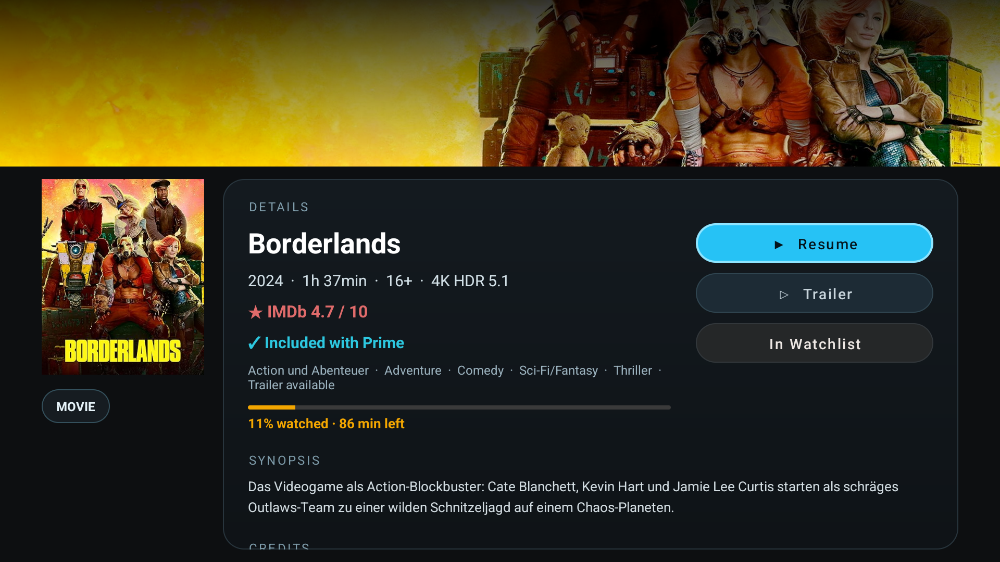

# ScriptGod's FireOS AmazonVOD

Native Android/Kotlin app for Fire TV that streams Amazon Prime Video content with Widevine L1 DRM.

## Features

### Authentication & Account

- **In-app login** — Amazon email/password + MFA/TOTP support via PKCE OAuth device registration
- **Sign Out** via About screen (⚙ gear button) — clears tokens, records logout timestamp, returns to login
- **Automatic token refresh** on 401/403 — transparent re-auth via OkHttp interceptor chain

### Home Screen & Discovery

- **Home page horizontal carousels** — categorised rails (Featured, Trending, Top 10, etc.) matching the real Prime Video home layout, with page-level infinite scroll for more rails
- **Continue Watching row** — first rail on the home screen, built from centralized `ProgressRepository` data; shows amber progress bars and remaining-time subtitles; hero strip overrides to "X% watched · Y min left" when CW is active; bypasses source/type filters; direct-play passes the current resume position explicitly into the player
- **Search** with instant results
- **Filter** by source (All / Prime) and type (Movies / Series) — filters combine independently
- **Freevee section** (territory-dependent)
- **D-pad navigation** optimized for Fire TV remote

### Content Detail Page

Selecting any movie or series opens a full detail screen before playback:

- Hero backdrop image, poster, year / runtime / age rating, quality badges (4K / HDR / 5.1), IMDb rating (colour-coded), genres, synopsis, director credit
- **▶ Resume / ▶ Play** — shows "Resume" when progress > 10 s, "Play" otherwise
- **▷ Trailer** button (distinct outline icon, shown only when `isTrailerAvailable: true`)
- **Amber progress bar + "X% watched · Y min left"** for partially-watched titles
- **Browse Episodes** + **All Seasons** buttons for series/seasons — All Seasons lets you jump directly to any other season
- **☆ / ★ Watchlist** toggle
- **Prime badge** — "✓ Included with Prime" (teal) or "✗ Not included with Prime" (grey), sourced from the ATF v3 detail API

### Playback

- **Widevine L1** hardware-secure playback (DASH / MPD); automatic L3/SD fallback on emulators
- **Audio & subtitle track selection** — labels from Amazon's API metadata; Audio Description tagging; family grouping (main / AD / Dialogue Boost); channel layout suffix (`2.0`, `5.1`, `7.1`); MENU key or pause shows controls; overlay follows Media3 controller visibility with no flicker
- **Video format label** in overlay — active codec, resolution, and HDR status (e.g. `720p · H265 · SDR`, `4K · H265 · HDR10`), updated live as ABR ramps up
- **Seekbar seeking** — D-pad left/right seeks ±10 seconds per press (hold to repeat)
- **Resume from last position** — auto-seeks to where you left off; direct-play surfaces pass the saved position explicitly so resume works even after local cache is cleared
- **Watch progress tracking** via UpdateStream API (START / PLAY / PAUSE / STOP) + PES V2 session reporting

### Progress & Watchlist

- **Watch progress bars** on content cards and hero strip thumbnail — amber, sourced from centralized `ProgressRepository` (server-first on refresh, local cache during playback)
- **Watchlist management** — long-press / hold SELECT on any card to add/remove via styled confirmation overlay; also togglable from every detail page
- **Library** — purchases and rentals with pagination, sub-filters (Movies / TV Shows), and sort (Recent / A-Z / Z-A)

### Settings (About Screen)

- **Video quality selection** — HD H264 (720p), H265 (720p SDR), or 4K/DV HDR; device capability checks disable unavailable options; H265 fallback to H264 on CDN error
- **Audio passthrough toggle** — Off (default, PCM decode) / On (sends encoded AC3/EAC3 Dolby bitstream to AV receiver over HDMI); live HDMI capability badge; On disabled when device lacks passthrough support; one-time volume warning on first passthrough session

### UI Polish

- Animated focus ring + glow on cards, shimmer skeleton loading, page fade/slide transitions
- Pill-shaped nav bar; four card variants (portrait, landscape, episode, season)
- Semi-transparent gradient player overlay; consistent colour palette and dimension tokens

### CI/CD

- **GitHub Actions** — builds on version tags (`v*`), PRs to `main`, and manual dispatch; date-based versioning (`YYYY.MM.DD.N`); automatic signed APK releases

## Architecture

```
com.scriptgod.fireos.avod
 +-- auth/
 |   +-- AmazonAuthService.kt      Token management, OkHttp interceptors (auth, headers, logging)
 +-- api/
 |   +-- AmazonApiService.kt       Catalog, search, detail, watchlist, library, playback, stream reporting
 |   +-- ContentItemParser.kt      Parses catalog/rail JSON responses into ContentItem model objects
 +-- data/
 |   +-- ProgressRepository.kt     Centralized server-first progress store with local fallback cache
 +-- drm/
 |   +-- AmazonLicenseService.kt   Widevine license: wraps challenge as widevine2Challenge, unwraps widevine2License
 +-- model/
 |   +-- ContentItem.kt            Content data model (asin, title, imageUrl, contentType, watchProgressMs, ...)
 |   +-- ContentRail.kt            Named row of ContentItems (headerText, items, collectionId)
 |   +-- DetailInfo.kt             Detail page data model (synopsis, heroImageUrl, imdbRating, genres, ...)
 |   +-- TokenData.kt              Token JSON model (access_token, refresh_token, device_id, expires_at)
 +-- ui/
     +-- LoginActivity.kt          Amazon login: email/password + MFA, PKCE OAuth, device registration
     +-- MainActivity.kt           Home screen: rails or grid, search, nav, filters, pagination
     +-- AboutActivity.kt          App info, video quality + audio passthrough settings, Sign Out
     +-- DetailActivity.kt         Content overview: hero image, metadata, IMDb, trailer, play/browse buttons
     +-- BrowseActivity.kt         Series detail: seasons / episodes grid
     +-- PlayerActivity.kt         ExoPlayer with DASH + Widevine DRM, track selection, resume
     +-- RailsAdapter.kt           Outer vertical adapter (one row per ContentRail)
     +-- ContentAdapter.kt         Inner horizontal adapter with poster, watchlist star, progress bar
     +-- ShimmerAdapter.kt         Skeleton placeholder adapter shown during API calls
     +-- CardPresentation.kt       Card focus/scale animation helpers
     +-- WatchlistActionOverlay.kt Styled action overlay for Add/Remove watchlist confirmation
     +-- DpadEditText.kt           EditText with Fire TV remote keyboard handling
     +-- UiMotion.kt               Entry animation helper (revealFresh)
     +-- UiTransitions.kt          Page transition helpers
     +-- UiMetadataFormatter.kt    Badge and chip label formatting (4K, HDR, 5.1, codec, etc.)
```

## Screenshots

Current redesigned UI, captured from the Android TV emulator:

| Home | Search Results |
|:---:|:---:|
|  |  |

| Watchlist | Library |
|:---:|:---:|
|  |  |

| About / Settings | Season Detail |
|:---:|:---:|
|  |  |

| Season Picker | Episode Browse |
|:---:|:---:|
|  |  |

| Player Controls Overlay | Continue Watching row |
|:---:|:---:|
|  |  |

| Detail page — progress + Resume | Detail page — Play + Trailer |
|:---:|:---:|
|  |  |

## Known limitations

### Watch progress — centralized cache with server-first refresh

The app now uses a centralized `ProgressRepository`:
- on startup / refresh, server progress from the watchlist API is loaded first
- local cached progress from `SharedPreferences("progress_cache")` is merged underneath it
- during playback, local progress is updated every 30 seconds and on pause/stop/seek/error
- the home screen can backfill missing Continue Watching items by resolving local-only ASINs through the detail API

This means:

| Scenario | Progress shown? |
|---|---|
| Title is in your watchlist **and** you have watched part of it via the official app | ✓ Yes |
| Title is **not** in your watchlist but you started it in this app and local progress exists | ✓ Yes — if the ASIN can be resolved through the detail API |
| Title is **not** in your watchlist and you started it only in the official app on another device | ✗ No local signal in this app |
| In-progress **episode** (not the series) started in this app | ✓ Yes — if the episode ASIN is in local progress and metadata resolves |
| In-progress **episode** started only in the official app / another device | ✗ Usually no — Amazon does not expose a general server-side episode progress feed |
| Progress set **within this app** during current session | ✓ Yes — local cache updates immediately |
| Progress set in the official app or on another device after this app has already started | △ Not immediately — visible after the next repository refresh / app restart |

**Why**: Amazon's official Prime Video app stores some in-progress playback state in a private local
SQLite database (`UserActivityHistory`) that is written during playback and read by the
`ContinueWatchingCarouselProvider`. Third-party clients cannot read that database. The only
server-readable progress signal available here is `remainingTimeInSeconds` on watchlist items.

**Current sync policy**:
- server progress wins when the app refreshes the repository
- local progress wins during the current playback session until the next refresh

**Known limitation**: there is no trustworthy backend `lastUpdatedAt` timestamp exposed by the
Amazon APIs used here. Because of that, the app cannot do true conflict resolution between:
- local progress written by this app
- newer progress written by the official app or another device on the same account

If the same account is used in multiple apps/devices at the same time, short-lived progress
differences can happen until this app refreshes from the server again.

**Practical result**:
- watchlisted titles are the most reliable cross-device source
- local playback in this app is reflected immediately
- local-only Continue Watching items can appear even when the title is not currently backed by the
  server watchlist progress set, as long as the app has a resumable ASIN and can resolve metadata

### Speed control unavailable

`player.setPlaybackSpeed()` is silently reset to 1.0× by Amazon's EMP (Extras Media Player)
system service via a hidden MediaSession proxy on Fire OS. Not implemented.

## Roadmap

See [dev/progress.md](dev/progress.md) for the full phase-by-phase build history and upcoming work.

**Recently completed:**
- **Phase 31** — Minor UI polish: detail page amber progress bar + "X% watched · Y min left" for
  partially watched titles; **▶ Resume** / **▶ Play** distinction on the Play button; **▷ Trailer**
  distinct outline icon; amber progress bar on home hero strip thumbnail; removed redundant
  "Feature film" fallback label from movie cards (overline already says "Movie")
- **Phase 30** — Centralized `ProgressRepository`: single source of truth for all ASIN progress;
  server-first refresh + local fallback cache; periodic local writes during playback; no more
  progress intent chain; Home can backfill local-only Continue Watching items by ASIN; Continue
  Watching movies and episodes now direct-play and pass explicit resume positions to the player
- **Phase 29** — Continue Watching row: first rail on the home screen built from server-side
  watchlist progress; amber progress bars + remaining-time subtitles; hero strip overrides to
  progress meta; bypasses source/type filters; `RailsAdapter` adapter-reuse fix eliminates
  first-item flicker; pool contamination fix in `ContentAdapter`
- **Phase 28** — Widevine L3/SD fallback: emulator playback enabled; L3 device detected at
  player-creation time and forced to SD quality (mirrors official APK `ConfigurablePlaybackSupportEvaluator`)

**Next up:**
- Seekbar thumbnail preview during scrubbing (Phase 32) — requires DASH trick-play track
  investigation per title before UI implementation
- Deeper cross-device progress conflict resolution if Amazon exposes a trustworthy backend
  progress timestamp in a future API path

## Requirements

- Android SDK (API 34, build-tools 34.0.0)
- Java 17
- A valid Amazon account (login in-app) or a `.device-token` file for development

## Build

```bash
./gradlew assembleRelease
```

Output: `app/build/outputs/apk/release/app-release.apk`

### Versioned build (CI style)

```bash
./gradlew assembleRelease \
  -PversionNameOverride=2026.02.28.1 \
  -PversionCodeOverride=20260228
```

## Deploy to Fire TV

```bash
# Connect to Fire TV
adb connect <device-ip>:5555

# Install
adb install -r app/build/outputs/apk/release/app-release.apk

# Launch
adb shell am start -n com.scriptgod.fireos.avod/.ui.LoginActivity
```

## Authentication

### In-app login (recommended)
Launch the app and sign in with your Amazon email, password, and verification code. The app performs PKCE OAuth authentication and registers the device with Amazon. Tokens are saved to the app's internal storage.

### Development token (debugging)
For development, you can pre-push a `.device-token` file:
```bash
adb push .device-token /data/local/tmp/.device-token
adb shell chmod 644 /data/local/tmp/.device-token
```
The app auto-detects an existing token and skips the login screen. Generate the token with `dev/register_device.py`.

**After signing out:** The app records a `logged_out_at` timestamp and skips the legacy token that was present at sign-out time. To resume development without logging in again, push a fresh token and `touch` it so its mtime is newer than the logout timestamp (`adb push` preserves the host file's mtime, so the touch is required):
```bash
adb push .device-token /data/local/tmp/.device-token
adb shell touch /data/local/tmp/.device-token
```
The app compares the file's mtime against `logged_out_at` — if the file is newer it accepts the token and clears the flag automatically.

## CI/CD

GitHub Actions builds APKs on version tags (`v*`), pull requests to `main`, and manual dispatch. Versioning uses the date format `YYYY.MM.DD.N` (e.g., `2026.02.27.5`).

[View recent builds](https://github.com/ScriptGod1337/amazon-vod-android/actions) | [Download latest release](https://github.com/ScriptGod1337/amazon-vod-android/releases/latest)

### Required GitHub Secrets

| Secret | Description |
|--------|-------------|
| `RELEASE_KEYSTORE_BASE64` | Base64-encoded `release.keystore` |
| `RELEASE_STORE_PASSWORD` | Keystore password |
| `RELEASE_KEY_ALIAS` | Key alias |
| `RELEASE_KEY_PASSWORD` | Key password |

Generate the keystore secret:
```bash
base64 -w0 release.keystore | pbcopy  # macOS
base64 -w0 release.keystore           # Linux (pipe to clipboard)
```

Pushing a version tag (e.g., `git tag v2026.02.28.1 && git push --tags`) creates a GitHub Release with the signed APK attached.

## Emulator notes

An Android TV emulator (API 34) works for UI, API development, and login testing. Widevine DRM playback requires a physical Fire TV device (L1 hardware security).

## Development tooling

Agent instructions, build automation scripts, and API analysis are in the `dev/` folder. See `dev/README.md`.
