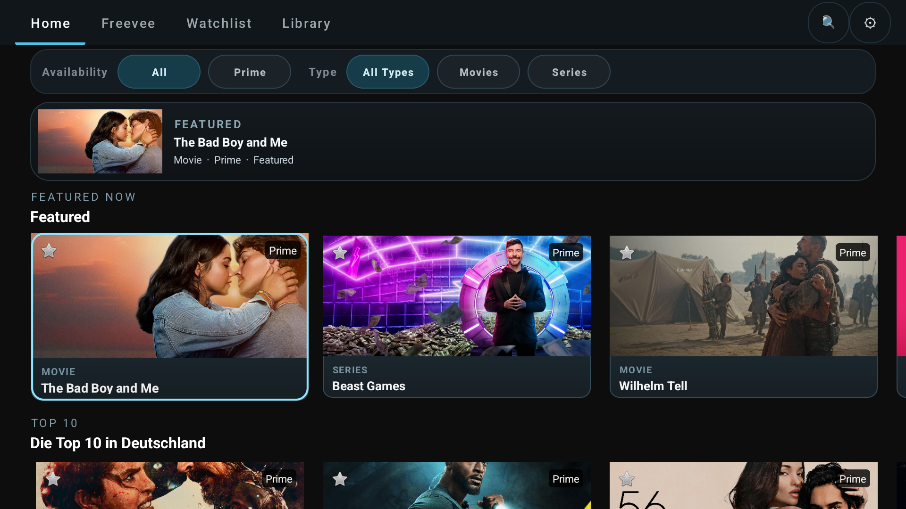
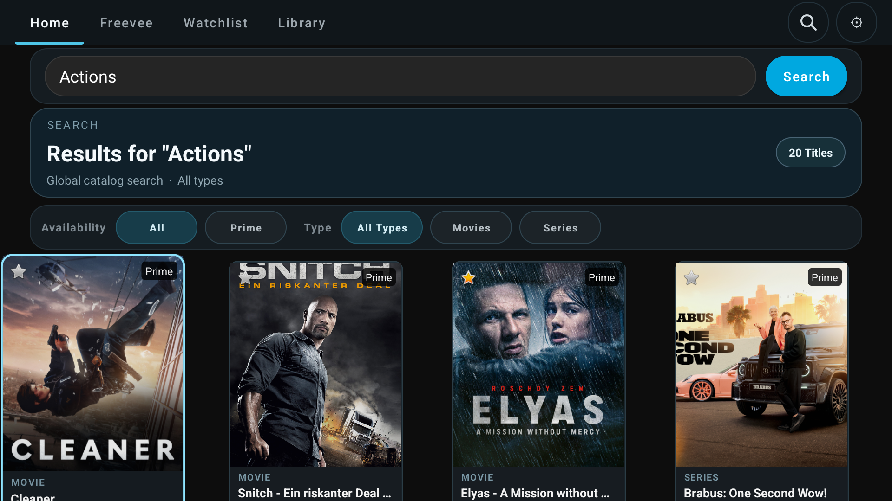
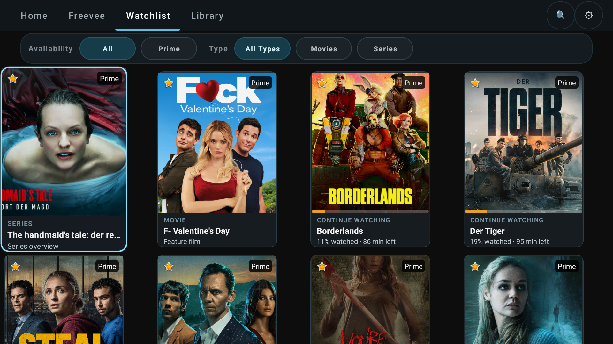
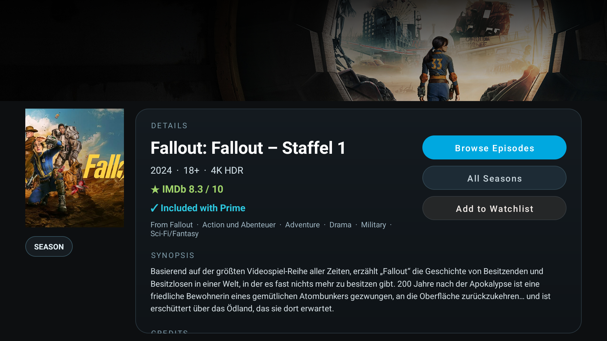
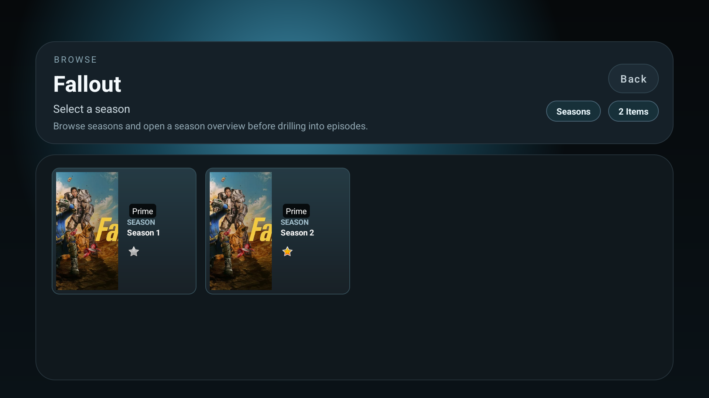
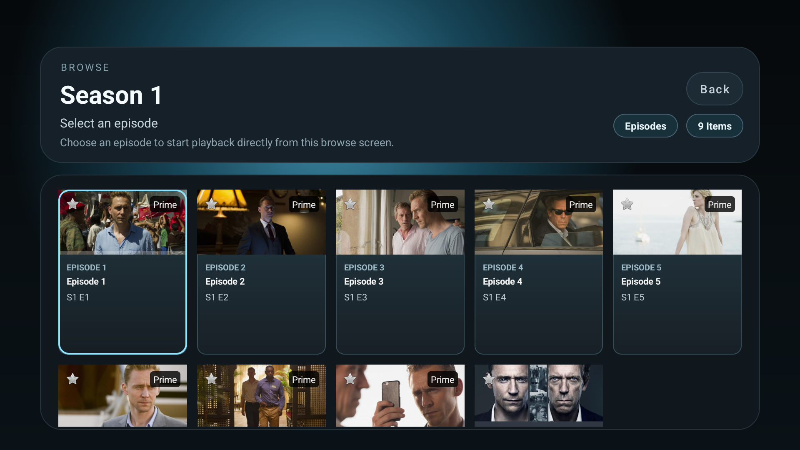
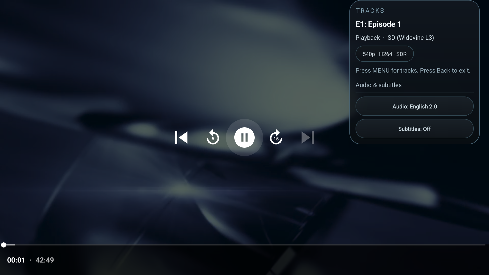

# ScriptGod's FireOS AmazonVOD

Native Android/Kotlin app for Fire TV that streams Amazon Prime Video content with Widevine L1 DRM.

## Features

- **In-app login** with Amazon email/password + MFA support (PKCE OAuth device registration)
- **Sign Out** via About screen (⚙ gear button) — clears tokens and returns to login
- **Continue Watching row** — first rail on the home screen, built from server-side watchlist progress; shows amber progress bars and remaining-time subtitles; hero strip overrides to "X% watched · Y min left" when CW is active; bypasses source/type filters
- **Home page horizontal carousels** — categorised rails (Featured, Trending, Top 10, etc.) matching the real Prime Video home layout, with page-level infinite scroll for more rails
- **Content overview / detail page** — selecting any movie or series opens a full detail screen before playback: hero backdrop image, poster, year/runtime/age rating, quality badges (4K/HDR/5.1), IMDb rating, genres, synopsis, director credit
  - **▶ Play** button for movies
  - **▶ Trailer** button (shown only when `isTrailerAvailable: true`)
  - **Browse Episodes** + **All Seasons** buttons for series/seasons — All Seasons lets you jump to any other season without navigating back
  - **☆ / ★ Watchlist** toggle on every detail page
  - **Prime badge** — every detail page shows "✓ Included with Prime" (teal) or "✗ Not included with Prime" (grey), sourced from the ATF v3 detail API for accurate per-title, per-territory status
- **Watch progress bars** on content cards — amber for in-progress, synced with server-side `remainingTimeInSeconds` so progress from the official app shows up here too
- Browse home catalog, watchlist, and personal library
- Search with instant results
- Filter by source (All / Prime) and type (Movies / Series) — filters combine independently
- Series drill-down: show → detail page → seasons → detail page → episodes → play
- Widevine L1 hardware-secure playback (DASH/MPD)
- **Audio & subtitle track selection** during playback — labels sourced from Amazon's API metadata for correct display names, Audio Description tagging, and family grouping (main / AD / Dialogue Boost); channel layout suffix shown (`2.0`, `5.1`, `7.1`); MENU key or pause shows controls; overlay follows Media3 controller visibility exactly with no flicker
- **Video format label** in player overlay — shows active codec, resolution, and HDR status (e.g. `720p · H265 · SDR`, `4K · H265 · HDR10`), updated live as ABR ramps up
- **Video quality selection** in About screen — choose between HD H264 (720p), H265 (720p SDR), or 4K/DV HDR; device capability checks disable unavailable options; H265 fallback to H264 on CDN error
- **Audio passthrough toggle** in About screen — Off (default, PCM decode) / On (sends encoded AC3/EAC3 Dolby bitstream directly to AV receiver over HDMI); live HDMI capability badge shows supported formats; On button disabled when device output does not report passthrough support; one-time volume warning on first passthrough session
- **Seekbar seeking** — D-pad left/right seeks ±10 seconds per press (hold to repeat), matching standard Fire TV remote behaviour
- **Watch progress tracking** via UpdateStream API (START/PLAY/PAUSE/STOP)
- **Resume from last position** — automatically seeks to where you left off
- Watchlist management (long-press / hold SELECT to add/remove via styled action overlay)
- Library with pagination, sub-filters (Movies / TV Shows), and sort (Recent / A-Z / Z-A)
- Freevee section (territory-dependent)
- D-pad navigation optimized for Fire TV remote
- Automatic token refresh on 401/403
- **Polished TV UI** — animated focus ring + glow on cards, shimmer skeleton loading, page
  fade/slide transitions, pill-shaped nav bar, four card variants (portrait, landscape, episode,
  season), semi-transparent gradient player overlay, consistent colour palette and dimension tokens
- **CI/CD** via GitHub Actions with date-based versioning and automatic APK releases

## Architecture

```
com.scriptgod.fireos.avod
 +-- auth/
 |   +-- AmazonAuthService.kt      Token management, OkHttp interceptors (auth, headers, logging)
 +-- api/
 |   +-- AmazonApiService.kt       Catalog, search, detail, watchlist, library, playback, stream reporting
 |   +-- ContentItemParser.kt      Parses catalog/rail JSON responses into ContentItem model objects
 +-- drm/
 |   +-- AmazonLicenseService.kt   Widevine license: wraps challenge as widevine2Challenge, unwraps widevine2License
 +-- model/
 |   +-- ContentItem.kt            Content data model (asin, title, imageUrl, contentType, watchProgressMs, ...)
 |   +-- ContentRail.kt            Named row of ContentItems (headerText, items, collectionId)
 |   +-- DetailInfo.kt             Detail page data model (synopsis, heroImageUrl, imdbRating, genres, ...)
 |   +-- TokenData.kt              Token JSON model (access_token, refresh_token, device_id, expires_at)
 +-- ui/
     +-- LoginActivity.kt          Amazon login: email/password + MFA, PKCE OAuth, device registration
     +-- MainActivity.kt           Home screen: rails or grid, search, nav, filters, pagination
     +-- AboutActivity.kt          App info, video quality + audio passthrough settings, Sign Out
     +-- DetailActivity.kt         Content overview: hero image, metadata, IMDb, trailer, play/browse buttons
     +-- BrowseActivity.kt         Series detail: seasons / episodes grid
     +-- PlayerActivity.kt         ExoPlayer with DASH + Widevine DRM, track selection, resume
     +-- RailsAdapter.kt           Outer vertical adapter (one row per ContentRail)
     +-- ContentAdapter.kt         Inner horizontal adapter with poster, watchlist star, progress bar
     +-- ShimmerAdapter.kt         Skeleton placeholder adapter shown during API calls
     +-- CardPresentation.kt       Card focus/scale animation helpers
     +-- WatchlistActionOverlay.kt Styled action overlay for Add/Remove watchlist confirmation
     +-- DpadEditText.kt           EditText with Fire TV remote keyboard handling
     +-- UiMotion.kt               Entry animation helper (revealFresh)
     +-- UiTransitions.kt          Page transition helpers
     +-- UiMetadataFormatter.kt    Badge and chip label formatting (4K, HDR, 5.1, codec, etc.)
```

## Screenshots

Current redesigned UI, captured from the Android TV emulator:

| Home | Search Results |
|:---:|:---:|
|  |  |

| Watchlist | Library |
|:---:|:---:|
|  |  |

| About / Settings | Season Detail |
|:---:|:---:|
|  |  |

| Season Picker | Episode Browse |
|:---:|:---:|
|  |  |

| Player Controls Overlay | |
|:---:|:---:|
|  | |

## Roadmap

See [dev/progress.md](dev/progress.md) for the full phase-by-phase build history and upcoming work.

**Recently completed:**
- **Phase 24** — Home rail source filter: Prime / All chips now work on home carousels; Featured
  rail Prime false negatives fixed (hero items use `ENTITLED_ICON` + `"prime"` text check in
  `messagePresentationModel` — ENTITLED_ICON alone is insufficient as it is also used for channel
  subscriptions)
- **Phase 25** — Player overlay sync: overlay now tracks Media3 controller visibility exactly via
  `syncTrackButtonsRunnable`; audio track metadata sourced from Amazon APIs for accurate labels, AD
  tagging, and channel layout suffixes; native ExoPlayer subtitle/settings buttons suppressed
- **Fix** — Prime badge on detail page: `"✓ Included with Prime"` / `"✗ Not included with Prime"`
  shown on every detail screen; uses `badges.prime` from ATF v3 detail API (authoritative, not the
  unreliable catalog-level `showPrimeEmblem`)
- **Fix** — Watchlist star state now survives navigation back to the All Seasons browse grid;
  `BrowseActivity.onResume()` refreshes `isInWatchlist` from the in-memory `watchlistAsins` set
- **Phase 22** — Full UI redesign: animated focus ring + glow, shimmer skeleton loading, page
  fade/slide transitions, pill nav bar, four card variants, gradient player overlay, watchlist
  action overlay, `UiMetadataFormatter`, `ContentItemParser` (with unit tests)
- **Phase 23** — Content overview / detail page (`DetailActivity`) — hero image, poster, IMDb rating, genres, synopsis, Play/Trailer/Browse/Watchlist buttons; All Seasons button for quick season switching; trailer playback via `videoMaterialType=Trailer`
- **Phase 21** — AI code review (10 warnings, 0 critical); all warnings fixed — lifecycle leaks, password hygiene, header scoping, CI keystore cleanup, monotonic versionCode, server-order preservation

**Next up:**
- **Phase 26** — Configurable audio passthrough (Dolby AC3/EAC3 to AV receiver)
- **Phase 27** — AI code review (all code added since Phase 21)

## Requirements

- Android SDK (API 34, build-tools 34.0.0)
- Java 17
- A valid Amazon account (login in-app) or a `.device-token` file for development

## Build

```bash
./gradlew assembleRelease
```

Output: `app/build/outputs/apk/release/app-release.apk`

### Versioned build (CI style)

```bash
./gradlew assembleRelease \
  -PversionNameOverride=2026.02.28.1 \
  -PversionCodeOverride=20260228
```

## Deploy to Fire TV

```bash
# Connect to Fire TV
adb connect <device-ip>:5555

# Install
adb install -r app/build/outputs/apk/release/app-release.apk

# Launch
adb shell am start -n com.scriptgod.fireos.avod/.ui.LoginActivity
```

## Authentication

### In-app login (recommended)
Launch the app and sign in with your Amazon email, password, and verification code. The app performs PKCE OAuth authentication and registers the device with Amazon. Tokens are saved to the app's internal storage.

### Development token (debugging)
For development, you can pre-push a `.device-token` file:
```bash
adb push .device-token /data/local/tmp/.device-token
adb shell chmod 644 /data/local/tmp/.device-token
```
The app auto-detects an existing token and skips the login screen. Generate the token with `dev/register_device.py`.

**After signing out:** The app records a `logged_out_at` timestamp and skips the legacy token that was present at sign-out time. To resume development without logging in again, push a fresh token and `touch` it so its mtime is newer than the logout timestamp (`adb push` preserves the host file's mtime, so the touch is required):
```bash
adb push .device-token /data/local/tmp/.device-token
adb shell touch /data/local/tmp/.device-token
```
The app compares the file's mtime against `logged_out_at` — if the file is newer it accepts the token and clears the flag automatically.

## CI/CD

GitHub Actions builds APKs on version tags (`v*`), pull requests to `main`, and manual dispatch. Versioning uses the date format `YYYY.MM.DD.N` (e.g., `2026.02.27.5`).

[View recent builds](https://github.com/ScriptGod1337/amazon-vod-android/actions) | [Download latest release](https://github.com/ScriptGod1337/amazon-vod-android/releases/latest)

### Required GitHub Secrets

| Secret | Description |
|--------|-------------|
| `RELEASE_KEYSTORE_BASE64` | Base64-encoded `release.keystore` |
| `RELEASE_STORE_PASSWORD` | Keystore password |
| `RELEASE_KEY_ALIAS` | Key alias |
| `RELEASE_KEY_PASSWORD` | Key password |

Generate the keystore secret:
```bash
base64 -w0 release.keystore | pbcopy  # macOS
base64 -w0 release.keystore           # Linux (pipe to clipboard)
```

Pushing a version tag (e.g., `git tag v2026.02.28.1 && git push --tags`) creates a GitHub Release with the signed APK attached.

## Emulator notes

An Android TV emulator (API 34) works for UI, API development, and login testing. Widevine DRM playback requires a physical Fire TV device (L1 hardware security).

## Development tooling

Agent instructions, build automation scripts, and API analysis are in the `dev/` folder. See `dev/README.md`.
